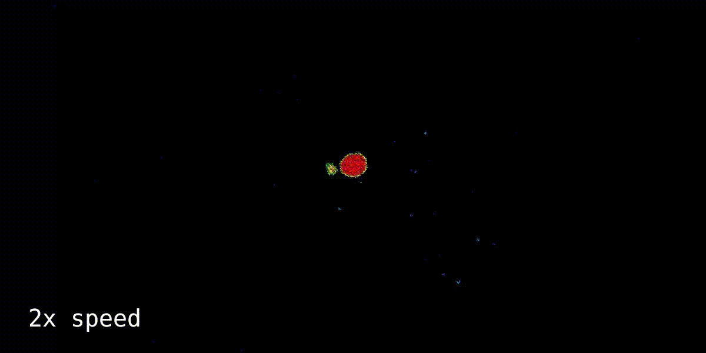
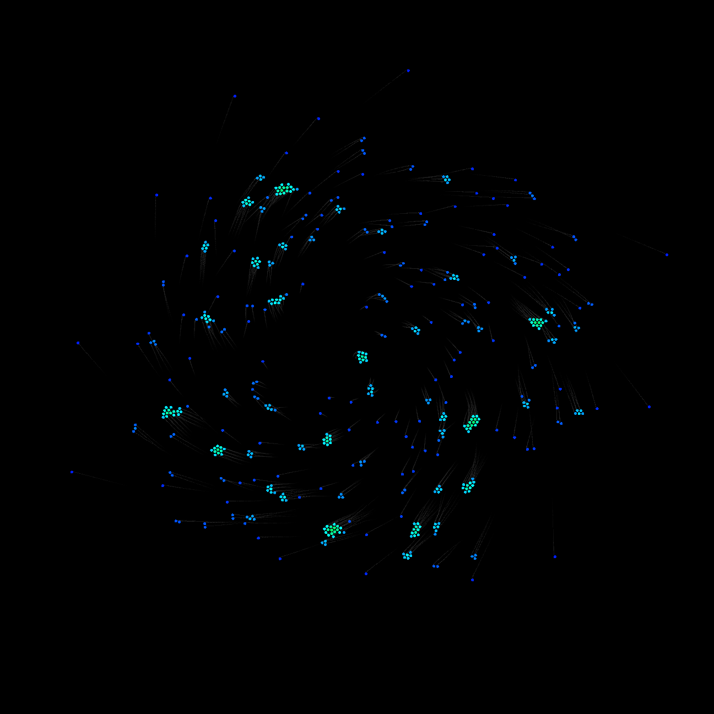
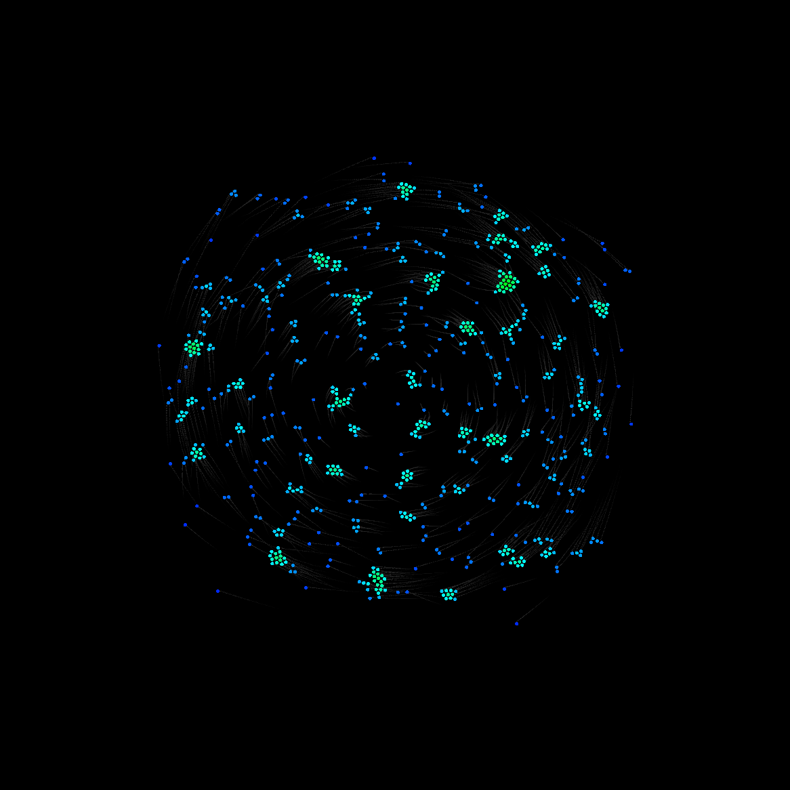
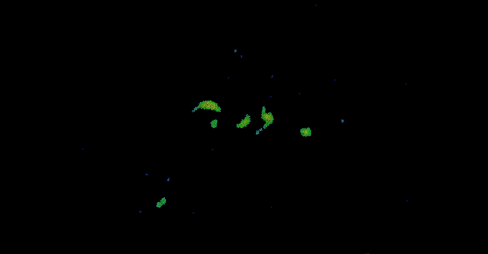

# Gravity Simulation V2

A particle system simulating gravitational forces made with C++ and SFML. Earlier, I had a Processing project simulating gravitational forces, which can be seen [here](https://github.com/balintjanik/gravity_simulation). Even though that project was fine, I decided to make the same simulation with C++ and SFML. In this project I am planning to make a much more accurate and computationally less effective simulation. Both the calculation of gravitational forces and the collisions are going to be optimized with spatial partitioning (grid).

Currently the program calculates the gravitational forces affecting the particles and collisions (avoid overlap and conservation of momentum) and updates the display based on it. Calculation optimizations are not yet implemented. A small damping force is applied on angular velocity when particles are close, to avoid planets tearing apart due to too high centrifugal force.

## Use
More on how to run this program will be shared soon.

## Samples
Some snapshots will be uploaded once the project is finished.

## Progress

### 2024.05.15 - Release v2.1.1
 - Added collision threshold setting
 - Added collision (overlap and conservation of momentum) switches
 - Added central speed setup
 - Played with settings

If a planet is too dense it randomly shoots out some particles, resulting in solar flare-like behaviour

### 2024.05.15. - v2.1.0 (no release, changes can be found in v2.1.1)
 - Added damping to angular velocities for close particles
 - Added overall velocity damping for close particles
 - These modifications do not allow the centrifugal forces to tear apart planets so easily
 - Planet formation is possible now!

Now the formation of planets has become possible, and the implemented angular velocity dampings prevent them from being torn apart by centrifugal forces.

### 2024.05.15. - Release v2.0.1
 - The option of trails for particles is added, to achieve better visuals
 - Small amount of damping added
 - Organised code and variable names
 - Setup types can be specified (fullscreen or circular)
 - Initial speeds can be specified (random, angular, or no speed)

    
    

### 2024.05.14. - Release v2.0.0
 - The base project is set up, particles can be rendered
 - The gravitational forces are implemented, and the particles are colored accordingly
 - The option of particles bouncing off screen borders is added
 - Collisions are implemented. First, overlaps are handled, and then collided particles "bounce off" of each other (conservation of momentum) with a small dampening to achieve planet formation

As it can be seen, the collision handling is infinitely more accurate in this simulation compared to my previous work in Processing.

