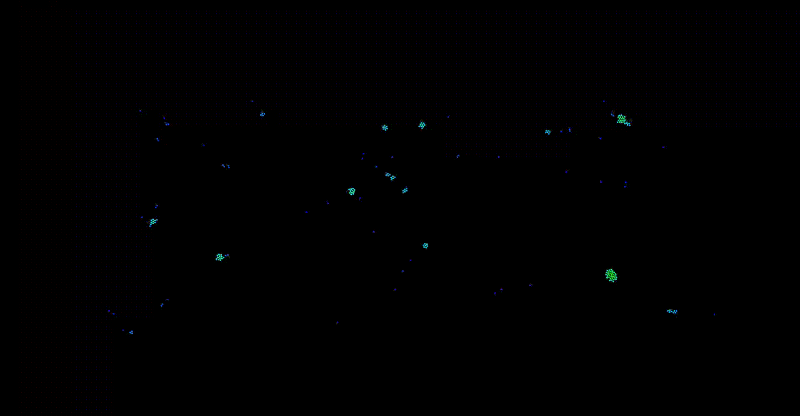

# Gravity Simulation V2
**!! Take a look at my original project [here](https://github.com/balintjanik/gravity_simulation) for visuals !!**

A particle system simulating gravitational forces made with C++ and SFML. Earlier, I had a Processing project simulating gravitational forces, which can be seen [here](https://github.com/balintjanik/gravity_simulation). Even though that project was fine, I decided to make the same simulation with C++ and SFML. In this project I am planning to make a much more accurate and computationally less effective simulation. Both the calculation of gravitational forces and the collisions are going to be optimized with spatial partitioning (grid).

Currently the program calculates the gravitational forces affecting the particles and collisions (avoid overlap and conservation of momentum) and updates the display based on it. Calculation optimizations are not yet implemented. A relatively weak additional attracting force is planned to be implemented for close particles, to support planet formation.

## Use
More on how to run this program will be shared soon.

## Samples
Some snapshots will be uploaded once the project is finished.

Current progress:

As it can be seen, the collision handling is infinitely more accurate in this simulation compared to my previous work in Processing. Now the formation of planets has become possible, however, the centrifugal forces are tearing apart the larger planets. This problem is unsolved for now.

## Progress

### 2024.05.15. - branch v2.0.1
 - The option of trails for particles is added, to achieve better visuals
 - Small amount of damping added
 - Organised code and variable names
 - Setup types can be specified (fullscreen or circular)
 - Initial speeds can be specified (random, angular, or no speed)

### 2024.05.14. - branch v2.0
 - The base project is set up, particles can be rendered
 - The gravitational forces are implemented, and the particles are colored accordingly
 - The option of particles bouncing off screen borders is added
 - Collisions are implemented. First, overlaps are handled, and then collided particles "bounce off" of each other (conservation of momentum) with a small dampening to achieve planet formation
