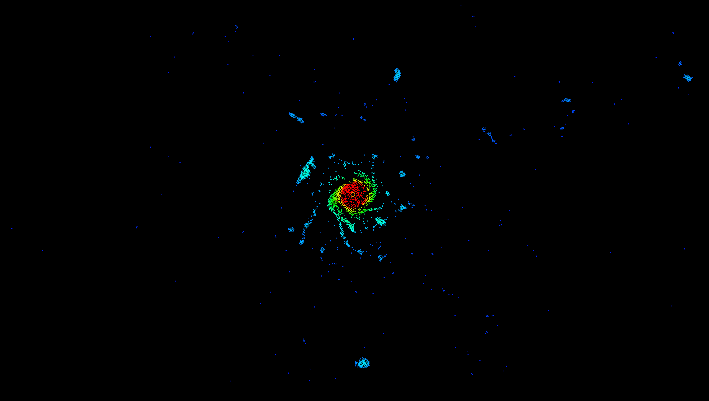
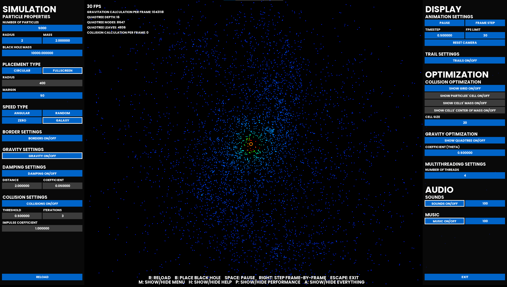
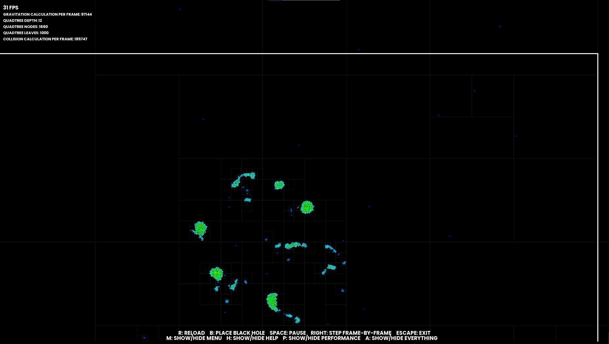

# Gravity Simulation V2

A particle system simulating gravitational forces made with C++ and SFML. Currently the program calculates the gravitational forces affecting the particles and collisions, and updates the display based on it. Collisions are optimized with a static grid based space partitioning approach, which works well for evenly distributed particles, but does not optimise enough in cases of large numbers of particles being concentrated in one place. As for the gravitational forces, a quadtree (Barnes-Hut algorithm) approach is implemented, to decrease the number of calculations necessary. A small damping force is applied on angular velocity when particles are close, to avoid planets tearing apart due to too high centrifugal force.

Now even a UI is implemented, so that any user can play around with some settings of the simulation, turning gravities, collisions and many other properties on or off, or fine-tuning some parameters to their own taste. Some sounds also help the user have an immersive experience (which of course can be turned off).

## Limitations (to be improved in the future)
 - Collisions are only implemented in the region of the screen, so when users move the camera around, the particles will not collide outside this region. Said region is marked with a white rectangle.
 - Help/documentation is not available for the settings, and some specific parameters' meaning might not be obvious for the average user. A table with explanation to every button and textbox is in the making.

## Use
More on how to try this program will be shared soon.

## Samples
Here are a few screenshots, but a demo video is planned, once the first release version is done.

**Screenshot 1:** particles orbiting a black whole with collisions turned on, every UI element is hidden.

**Screenshot 2:** particles orbiting a black whole with no collisions, all UI elements are visible.

**Screenshot 3:** particles are forming planets with both collisions and damping turned on, camera is moved away from the center.
