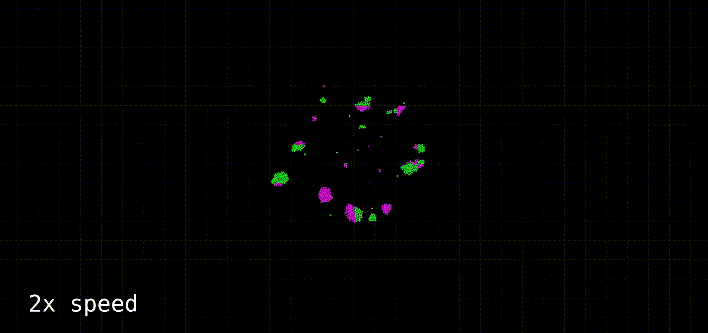

# Gravity Simulation V2

A particle system simulating gravitational forces made with C++ and SFML. Earlier, I had a Processing project simulating gravitational forces, which can be seen [here](https://github.com/balintjanik/gravity_simulation). Even though that project was fine, I decided to make the same simulation with C++ and SFML. In this project I am planning to make a much more accurate and computationally less effective simulation. Both the calculation of gravitational forces and the collisions are going to be optimized with spatial partitioning (grid).

Currently the program calculates the gravitational forces affecting the particles and collisions (avoid overlap and conservation of momentum) and updates the display based on it. Both collisions and gravitational forces are optimized with a static grid based space partitioning approach, which works well for evenly distributed particles, but does not optimise enough in cases of large numbers of particles being concentrated in one place (maybe a quadtree approach would work better, whcih I might implement in the future). A small damping force is applied on angular velocity when particles are close, to avoid planets tearing apart due to too high centrifugal force.

## Use
More on how to run this program will be shared soon.

## Samples
Some snapshots will be uploaded once the project is finished.

## Progress

### 2024.05.26 - Release v2.4.0 [IN PROGRESS]
 - Added menu
 
**Note:** there is a bug where the simulation stops when a particle reaches the edge of the screen and borders are turned off.

### 2024.05.21 - Release v2.3.2
 - Fixed uneven damping forces

### 2024.05.21 - Release v2.3.1
 - Removed float values
 - Added center of mass visualization option

**Note:** noise is due to compression, I don't want to fill the repo with large image files

### 2024.05.19 - Release v2.3.0
 - Reorganised header files
 - Switched to doubles from floats
 - Added global particles
 - Added static grid based spatial partitioning optimization to calculation of gravitational forces
 - Added collision iteration option for higher accuracy collision handling
 - Fixed lack of collision handling at screen edges
 - Fixed particle not rendering at correct position bug
 - Added cell mass visualization

Now a stable and fast real-time simulation with 700-1000 particles is possible with both collisions and gravity enabled, however the static grid is not optimising enough when all particles are merged into one "planet". Sample of 1000 particles in real-time:

**Note:** small lag and noise is only due to recording compression

### 2024.05.17 - Release v2.2.0
 - Added static grid based spatial partitioning optimization to collision handling
 - Added grid visualization settings

**Note:** grid is not always visible in these samples due to compression

Here you can see 3000 particles rendered with collision handling in real time (gravity is turned off here, as that is not optimized yet, and significantly increases computational times)

### 2024.05.15 - Release v2.1.1
 - Added collision threshold setting
 - Added collision (overlap and conservation of momentum) switches
 - Added central speed setup
 - Played with settings

If a planet is too dense it randomly shoots out some particles, resulting in solar flare-like behaviour

### 2024.05.15. - v2.1.0 (no release, changes can be found in v2.1.1)
 - Added damping to angular velocities for close particles
 - Added overall velocity damping for close particles
 - These modifications do not allow the centrifugal forces to tear apart planets so easily
 - Planet formation is possible now!

Now the formation of planets has become possible, and the implemented angular velocity dampings prevent them from being torn apart by centrifugal forces.

### 2024.05.15. - Release v2.0.1
 - The option of trails for particles is added, to achieve better visuals
 - Small amount of damping added
 - Organised code and variable names
 - Setup types can be specified (fullscreen or circular)
 - Initial speeds can be specified (random, angular, or no speed)

    
    

### 2024.05.14. - Release v2.0.0
 - The base project is set up, particles can be rendered
 - The gravitational forces are implemented, and the particles are colored accordingly
 - The option of particles bouncing off screen borders is added
 - Collisions are implemented. First, overlaps are handled, and then collided particles "bounce off" of each other (conservation of momentum) with a small dampening to achieve planet formation

As it can be seen, the collision handling is infinitely more accurate in this simulation compared to my previous work in Processing.

